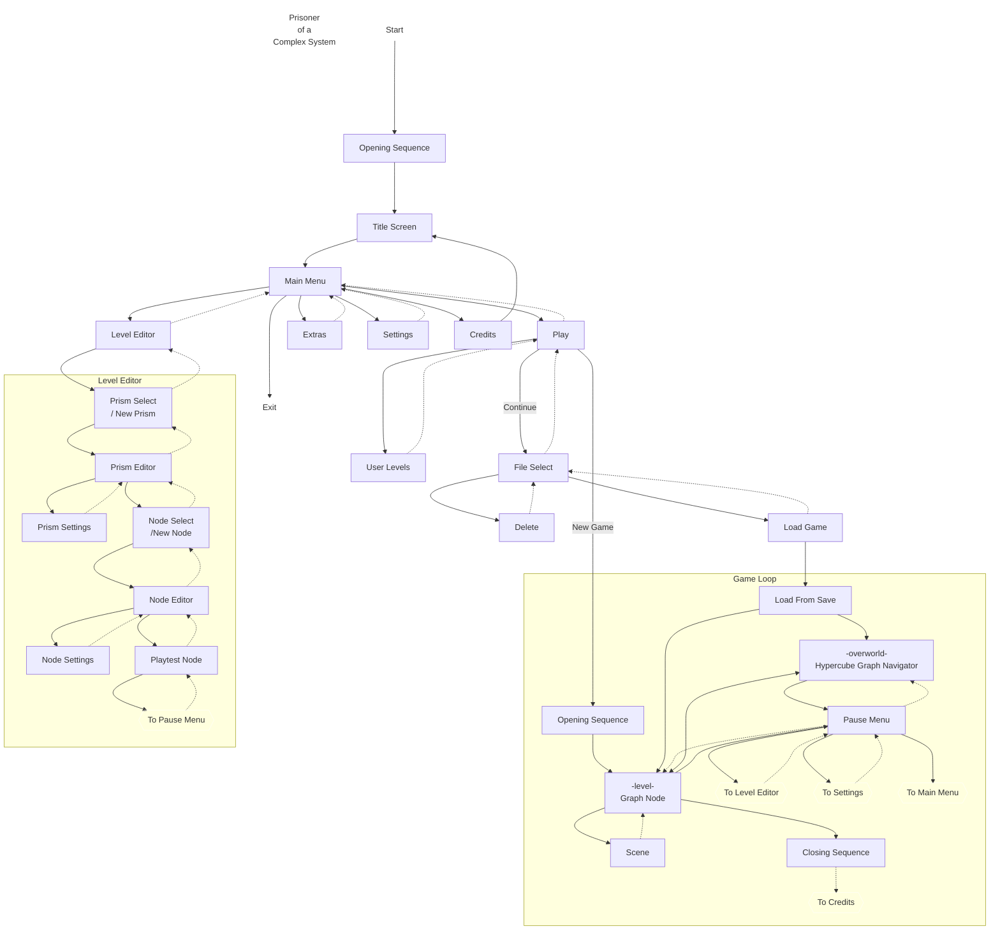

```mermaid
flowchart TD

	header --- header[Prisoner<br>of a<br>Complex System]
	
	start{{Start}} ----> opening[Opening Sequence]
	
	opening ---> title[Title Screen] --> menu[Main Menu]
	
	menu --> play[Play]         .-> menu
	menu --> edit[Level Editor] .-> menu
	menu --> extras[Extras]     .-> menu
	menu --> settings[Settings] .-> menu
	menu --> credits[Credits]   --> title
	menu ---> exit{{Exit}}
	
	play ---> |Continue| file[File Select] .-> play
	play --> |New Game| scene_start[Opening Sequence]
    play ---> user_levels[User Levels] .-> play
	
	file --> load[Load Game] & delete[Delete] .-> file
	load --> game_load[Load From Save]
	
	subgraph game[Game Loop]
		scene_start --> node[-level-<br>Graph Node] <--> hgn[-overworld-<br>Hypercube Graph Navigator]
		game_load --> hgn & node
		hgn & node --> pause[Pause Menu] .-> hgn & node
		scene[Scene] .-> node --> scene
		node --> scene_close[Closing Sequence] .-> to_credits{{To Credits}}
		pause --> to_edit{{To Level Editor}} & to_settings{{To Settings}} & to_menu{{To Main Menu}}
		to_edit & to_settings .-> pause
	end
	
	edit --> prism[Prism Select<br>/ New Prism] .-> edit

	subgraph edtor[Level Editor]
		prism --> prism_editor[Prism Editor] .-> prism
		prism_editor --> prism_settings[Prism Settings] & prism_node[Node Select<br>/New Node] .-> prism_editor
		prism_node --> node_editor[Node Editor] .-> prism_node
		node_editor --> node_settings[Node Settings] & playtest[Playtest Node] .-> node_editor
		playtest --> to_pause{{To Pause Menu}} .-> playtest
	end

%% styling %%

	classDef HEAD fill:#0000,stroke:#FFF0
	linkStyle 0 stroke:#0000
	class header HEAD;
	
	classDef TO fill:#0000,stroke:#FFFC,stroke-width:1,color:#FFFC %%stroke-dasharray:4%%
	class start,exit,to_edit,to_settings,to_menu,to_credits,to_pause TO
```